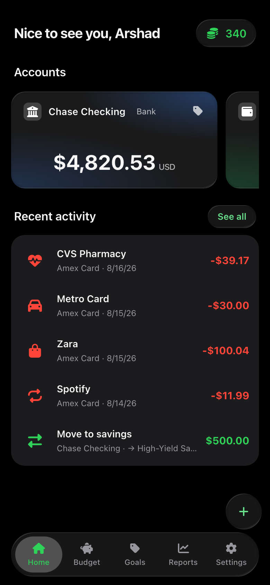
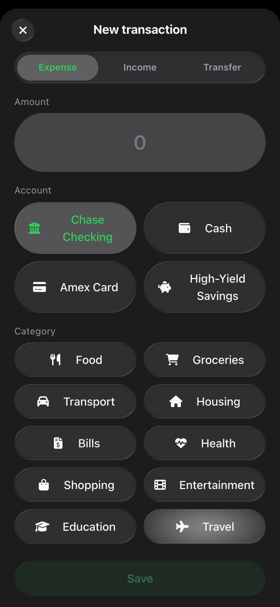
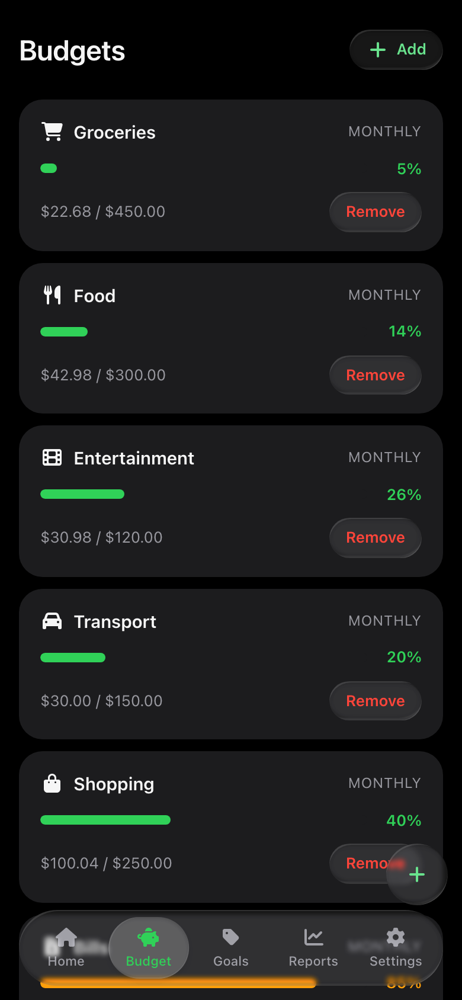
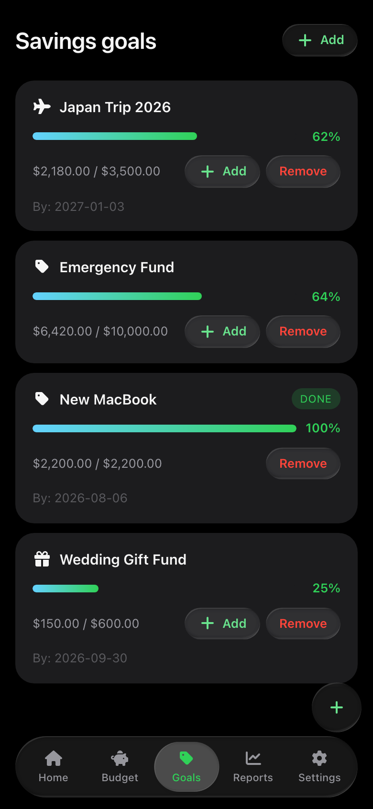
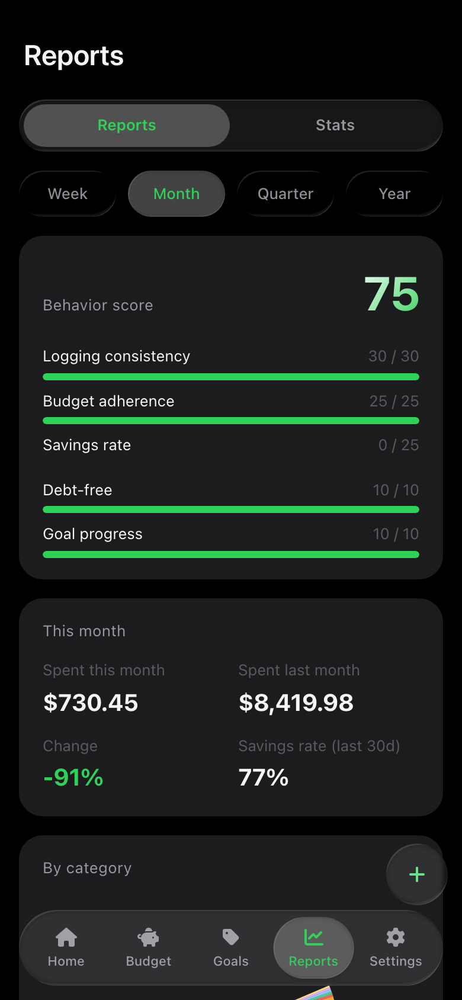
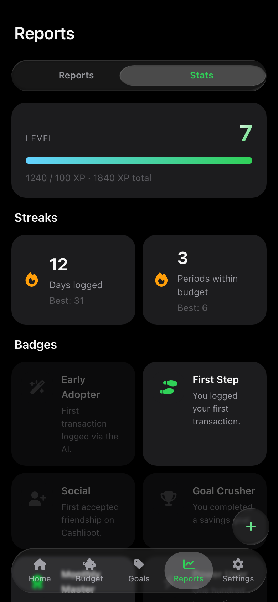

# Cashlibot

Telegram personal finance tracker — Bot + Mini App + Admin Dashboard.

Log transactions by chatting with the bot, get an LLM-parsed preview, and
confirm. See balances, budgets, goals, and weekly reports in the Mini App.
Split expenses with friends, hit XP levels for consistency, and top up
credits for AI features with Telegram Stars.

## Screenshots

<table>
<tr>
<td></td>
<td></td>
<td></td>
</tr>
<tr>
<td></td>
<td></td>
<td></td>
</tr>
</table>

## Stack at a glance

| Layer | Tech |
|---|---|
| Bot | aiogram 3 |
| API | FastAPI |
| Worker | APScheduler (co-located with the bot) |
| DB | PostgreSQL 16 + pgvector |
| ORM | SQLModel (SQLAlchemy 2 + Pydantic) |
| Cache | Redis 7 |
| AI orchestration | LangChain (DeepSeek / OpenAI / Anthropic) |
| Mini App | React 18 + Vite + TS |
| Admin | React 18 + Vite + TS |
| Prod ingress | Traefik on an external `web` network |

## Features

- **Onboarding** in the Mini App (language, timezone, calendar, currency).
- **Accounts + transactions** with per-currency balances and manual entry.
- **AI agent** parses free-text messages into a preview the user confirms.
- **Semantic memory** in pgvector and learned per-user categorisation rules.
- **Budgets** with warning / exceeded threshold alerts.
- **Savings goals** with contribution tracking + goal badges.
- **Gamification**: XP, levels, badges, daily-log streak.
- **Reminders** and **recurring** transactions with in-chat confirm/skip.
- **Credits + Telegram Stars** to top up for AI-metered features.
- **Friends** (with 20 XP on first accept) and **shared expenses** with split
  approvals + dispute + settle flow.
- **Analytics**: category breakdown, income-vs-expense, monthly trend,
  savings rate, behavior score, monthly comparison.
- **Weekly digest**: opt-out DM at a user-chosen day + hour with the last
  7 days' recap, top categories, budget hotspots, streak, and behavior score.
- **Admin dashboard**: JWT sign-in from `/admin` in the bot, KPI overview,
  paginated user search, credit adjustments backed by the same ledger.

## Running locally

You need:

- Docker Desktop running
- A Telegram bot token from [@BotFather](https://t.me/BotFather)
- Optionally, an AI provider key (DeepSeek / OpenAI / Anthropic)

### First time

```bash
cp .env.example .env
# At minimum: set TELEGRAM_BOT_TOKEN and TELEGRAM_BOT_USERNAME.
docker compose up --build
```

That brings up:

| Service | URL / Port |
|---|---|
| Postgres (pgvector) | `localhost:5432` |
| Redis | `localhost:6379` |
| API (FastAPI) | `http://localhost:8000` — try `/health` |
| Bot | polling Telegram (no exposed port) |
| Mini App (Vite dev) | `http://localhost:5173` |
| Admin (Vite dev) | `http://localhost:5174` |

Migrations run automatically on api / bot startup via the `migrate` service.

### Stop / reset

```bash
docker compose down          # stop
docker compose down -v       # also drop postgres data + node_modules volumes
```

## Deploying (Traefik + external `web` network)

The prod overlay `docker-compose.prod.yml` routes api / admin / miniapp
behind Traefik on a shared external network named `web`. TLS is handled by
Traefik itself via an ACME certResolver.

On the server:

```bash
docker network create web             # once
cp .env.example .env
# Fill in TELEGRAM_BOT_TOKEN, PUBLIC_HOSTNAME=cashlibot.example.com,
# MINIAPP_URL=https://cashlibot.example.com,
# ADMIN_URL=https://cashlibot.example.com/admin,
# TRAEFIK_CERT_RESOLVER=<name from Traefik's static config>,
# and the AI provider key(s) you use.

docker compose -f docker-compose.yml -f docker-compose.prod.yml up -d --build
```

Path-based routing on the single host:

| Path | Service |
|---|---|
| `/api/…` | api (FastAPI) |
| `/admin/…` | admin (with `VITE_BASE=/admin/`) |
| `/` (catch-all) | miniapp |
| `/health` | api |

Any HTTP hit on the same host is redirected to HTTPS.

## Repository layout

```
backend/    FastAPI + aiogram + APScheduler (one Python project)
  app/api/      HTTP handlers (miniapp + admin routers)
  app/bot/      aiogram routers
  app/ai/       LangChain agent, tools, memory
  app/services/ Domain services (accounts, budgets, digest, …)
  app/scheduler/ Periodic jobs (reminders, recurring, digest)
  app/models/   SQLModel tables
  migrations/   Alembic migrations
miniapp/    React + Vite Telegram Mini App
admin/      React + Vite admin dashboard
```

## Workflow

- Trunk-based: `master` is always deployable.
- Short-lived feature branches, `feat/<scope>/<description>` or
  `fix/<scope>/<description>`.
- Conventional Commits (`feat`, `fix`, `refactor`, `docs`, `chore`).
- Every branch merged via Pull Request.
- CI runs on every PR + push to `master` (`.github/workflows/ci.yml`):
  - **miniapp** and **admin** — TypeScript typecheck + `vite build`.
  - **backend** — `python -m compileall` + `alembic upgrade head` against a
    fresh `pgvector/pgvector:pg16` service, so every migration is exercised.
